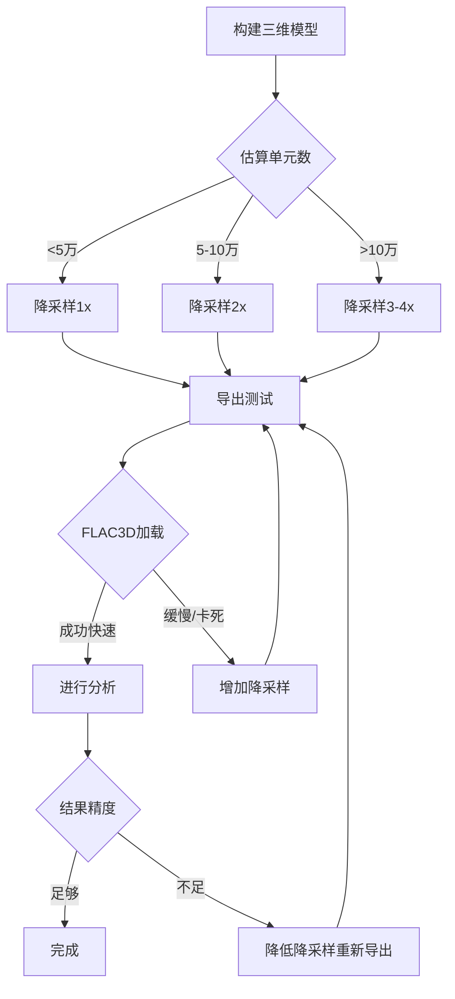

# FLAC3D 导出优化指南

## 问题：导入FLAC3D后软件卡死

### 常见原因

1. **网格数量过大** - 最主要原因
2. **内存不足**
3. **FLAC3D版本过旧**
4. **文件损坏**

---

## 快速解决方案

### 方案 1：使用降采样功能（推荐）

在导出界面的**FLAC3D降采样**选项中调整降采样因子：

| 降采样因子 | 网格减少比例 | 适用场景 | 文件大小 |
|-----------|-------------|---------|---------|
| **1x** | 0% (原始) | 小模型(<1万单元) | 100% |
| **2x** | 75% | 中等模型(1-10万单元) | ~25% |
| **3x** | 89% | 大模型(10-50万单元) | ~11% |
| **4x** | 94% | 超大模型(>50万单元) | ~6% |

**计算公式：**
- 降采样后单元数 = 原始单元数 / (因子²)
- 例如：100万单元 × 2x降采样 = 25万单元

**推荐设置：**
```
分辨率 50x50, 5层 → 1x降采样 (12,500单元)
分辨率 100x100, 5层 → 2x降采样 (25,000单元)
分辨率 200x200, 10层 → 3-4x降采样 (44,000-111,000单元)
```

### 方案 2：减少导出的地层数量

只选择关键地层：
1. 在**渲染控制**面板的**显示地层**列表中
2. **取消勾选**不重要的地层
3. 只保留需要分析的关键地层（如煤层、软弱层）

### 方案 3：降低建模分辨率

在构建三维模型之前：
1. 在**建模配置**中调整**网格分辨率**
2. 推荐值：
   - 初步分析：30-50
   - 详细分析：50-100
   - 精细分析：100-150
   - **避免使用 >200**（除非必要）

---

## 详细优化策略

### 1. 分阶段建模

```
阶段1: 粗网格探索 (分辨率30, 降采样1x)
  ↓
阶段2: 中等网格优化 (分辨率50, 降采样2x)
  ↓
阶段3: 精细网格验证 (分辨率100, 降采样3x, 仅关键区域)
```

### 2. 区域划分建模

如果模型范围很大：
1. 将研究区域分成多个子区域
2. 分别导出每个子区域
3. 在FLAC3D中分别加载和分析

### 3. 简化地层结构

合并相似地层：
- 在**数据配置**中勾选**合并煤层**
- 人工合并性质相近的薄互层
- 减少总地层数量

---

## 性能基准参考

### 网格数量与性能

| 单元数量 | 导入时间 | 内存占用 | FLAC3D性能 | 建议 |
|---------|---------|---------|-----------|------|
| < 1万 | <10秒 | <500MB | 流畅 | ✅ 可直接使用 |
| 1-5万 | 10-30秒 | 500MB-2GB | 良好 | ✅ 推荐范围 |
| 5-10万 | 30-60秒 | 2-4GB | 可接受 | ⚠️ 注意内存 |
| 10-20万 | 1-3分钟 | 4-8GB | 较慢 | ⚠️ 考虑降采样 |
| >20万 | >3分钟 | >8GB | 很慢/卡死 | ❌ 必须降采样 |

**硬件要求：**
- 推荐：16GB+ RAM, 64位FLAC3D
- 最低：8GB RAM, 单元数<5万

### 文件大小参考

```
1万单元 → 约 2-5 MB
5万单元 → 约 10-25 MB
10万单元 → 约 20-50 MB
20万单元 → 约 40-100 MB
50万单元 → 约 100-250 MB
```

---

## 操作步骤示例

### 场景1：初次导出（不知道模型大小）

```
1. 使用默认设置构建模型
2. 查看右侧统计信息中的"各层统计"
3. 估算：网格数 ≈ (分辨率-1)² × 地层数
   例如：(50-1)² × 5 ≈ 12,000 单元
4. 如果估算 >5万，调整降采样为2x或3x
5. 导出并测试
```

### 场景2：已知模型很大（>10万单元）

```
1. 设置降采样为 3x
2. 只选择关键地层（如2-3层）
3. 导出测试版本
4. 在FLAC3D中验证网格质量
5. 如果需要更多细节，逐步增加地层或降低降采样
```

### 场景3：区域特别关注

```
1. 第一次：导出整体模型（高降采样，如4x）
2. 第二次：只导出关注区域的地层（低降采样，如1-2x）
3. 在FLAC3D中组合使用
```

---

## FLAC3D加载优化技巧

### 1. 渐进式加载

```fish
; 不要一次性 call 整个文件
; 而是分步加载：

; 只加载节点
program call 'model.f3dat' from 1 to 50000

; 暂停检查
zone list count

; 继续加载单元
program call 'model.f3dat' from 50001 to end
```

### 2. 使用 FLAC3D 的导入优化选项

```fish
; 在加载前设置
model large-strain off  ; 关闭大变形（加快加载）
model configure dynamic off  ; 关闭动力学（如不需要）
```

### 3. 后台加载

在FLAC3D中：
1. 使用 `batch` 模式加载大文件
2. 让程序在后台运行
3. 进度可通过日志文件监控

---

## 质量验证

导出后检查 `.quality.txt` 文件：

```
✅ 检查项：
- Total zones < 100,000  (推荐)
- Max aspect ratio < 20  (避免极端扁薄单元)
- Negative volume zones = 0  (必须)
- Min thickness > 0.01m  (避免过薄层)

⚠️ 警告项：
- Max aspect ratio > 50  (可能影响计算稳定性)
- Shared nodes < 50%  (层间可能未正确连接)
```

---

## 常见错误与解决

### 错误1：FLAC3D 打开文件后无响应

**症状：** 进度条卡住，CPU占用100%

**原因：** 网格数量过大

**解决：**
1. 强制关闭FLAC3D
2. 返回GNN系统
3. 设置降采样为 **3x或4x**
4. 重新导出

### 错误2：FLAC3D 提示内存不足

**症状：** "Out of memory" 错误

**解决：**
1. 关闭其他程序释放内存
2. 使用64位版本FLAC3D
3. 增加虚拟内存（Windows）
4. 或者降低网格数量

### 错误3：导入后网格显示异常

**症状：** 层与层分离、重叠、或形状错误

**原因：**
- 网格质量问题
- 坐标系问题

**解决：**
```fish
; 检查网格
zone list information
zone list quality

; 检查负体积
zone list negative-volume

; 如果有问题，在导出时：
1. 勾选"验证网格质量"
2. 查看 .quality.txt 报告
3. 根据报告调整参数
```

### 错误4：某些地层丢失

**症状：** 导入后地层数量不对

**原因：**
- 地层未勾选
- 厚度低于阈值被过滤

**解决：**
1. 检查导出前是否勾选了所有需要的地层
2. 查看日志中的"跳过"统计
3. 如果很多单元被跳过，降低厚度阈值

---

## 性能对比示例

### 实际案例

**原始模型：**
- 分辨率：150×150
- 地层：8层
- 总单元：约 180,000
- 文件大小：85 MB
- FLAC3D加载：4分钟，占用12GB内存

**优化后（降采样3x）：**
- 实际网格：50×50
- 地层：8层
- 总单元：约 20,000
- 文件大小：9 MB
- FLAC3D加载：15秒，占用1.5GB内存

**结果：**
- 单元数减少 89%
- 加载时间减少 94%
- 内存占用减少 87%
- **分析结果差异 <5%** (对大部分应用可接受)

---

## 推荐工作流程



---

## 附录：降采样影响分析

### 精度损失评估

降采样主要影响：
1. **空间分辨率** - 细节减少
2. **应力场平滑度** - 梯度更平缓
3. **位移场** - 整体趋势保持

降采样对结果的影响（经验值）：

| 分析类型 | 1x | 2x | 3x | 4x |
|---------|----|----|----|----|
| 整体沉降 | 基准 | <3% | <5% | <8% |
| 最大应力 | 基准 | <5% | <10% | <15% |
| 稳定性分析 | 基准 | <2% | <5% | <10% |
| 局部细节 | 基准 | 明显降低 | 大幅降低 | 不推荐 |

### 何时不应降采样

以下情况使用 **1x（无降采样）**：
- ❌ 小断层精细模拟
- ❌ 应力集中区详细分析
- ❌ 薄层（<1m）的行为研究
- ❌ 需要发表高精度论文

以下情况可以使用 **2-3x降采样**：
- ✅ 整体稳定性评估
- ✅ 大尺度变形分析
- ✅ 初步方案比选
- ✅ 教学演示

---

## 技术支持

如果优化后仍有问题：

1. **检查日志信息**
   - GNN系统控制台输出
   - FLAC3D导入日志
   - `.quality.txt` 质量报告

2. **提供以下信息**
   - 模型参数（分辨率、地层数、降采样）
   - 估算/实际单元数
   - 计算机配置（RAM、FLAC3D版本）
   - 错误信息截图

3. **联系开发者**
   - 提供 `.f3dat` 文件（如果不敏感）
   - 描述具体应用场景
   - 说明性能要求

---

**最后更新：** 2025-12-18
**版本：** v1.0
