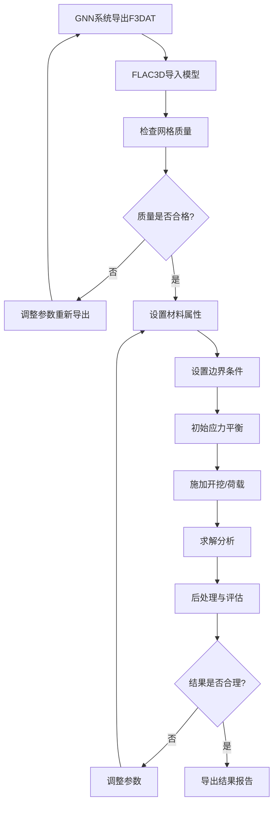

# FLAC3D 导出文件使用教程

## ⚠️ 重要提示

**如果导入后FLAC3D卡死或运行缓慢，请先阅读：[FLAC3D导出优化指南.md](FLAC3D导出优化指南.md)**

该指南包含：
- 降采样功能使用方法
- 性能优化建议
- 常见问题快速解决

---

## 目录
1. [什么是 FLAC3D](#什么是-flac3d)
2. [导出的 F3DAT 文件说明](#导出的-f3dat-文件说明)
3. [性能优化建议](#性能优化建议) ⭐ **新增**
4. [在 FLAC3D 中导入模型](#在-flac3d-中导入模型)
5. [模型检查与验证](#模型检查与验证)
6. [设置边界条件](#设置边界条件)
7. [运行数值模拟](#运行数值模拟)
8. [结果后处理](#结果后处理)
9. [常见问题与解决方案](#常见问题与解决方案)

---

## 什么是 FLAC3D

**FLAC3D** (Fast Lagrangian Analysis of Continua in 3 Dimensions) 是一款由 Itasca 公司开发的三维显式有限差分数值模拟软件，广泛应用于：

- 岩土工程分析
- 边坡稳定性评估
- 地下开挖模拟
- 基坑工程设计
- 地震动力响应分析
- 采矿工程设计

本系统导出的 `.f3dat` 文件是 FLAC3D 可直接读取的网格数据文件。

---

## 导出的 F3DAT 文件说明

### 文件结构

导出的 `.f3dat` 文件包含以下内容：

```
; ===================================
; GNN地质建模系统 - 三维模型
; Author: PyQt6高性能版
; Generated: 2025-xx-xx xx:xx:xx
; ===================================

; 网格统计信息
; 总节点数: xxxx
; 总单元数: xxxx
; 地层数: x

; 地层1: 砂岩
zone create brick point 0 (x1,y1,z1) ...
zone group 'Layer_砂岩'
zone property density=2400 young=10e9 ...

; 地层2: 泥岩
...
```

### 包含的数据

- **节点坐标** (X, Y, Z)
- **六面体单元** (Brick zones)
- **地层分组** (Group names)
- **材料属性**：
  - 密度 (density)
  - 杨氏模量 (Young's modulus)
  - 泊松比 (Poisson's ratio)
  - 内聚力 (cohesion)
  - 摩擦角 (friction angle)

---

## 性能优化建议

### 快速检查清单

在导出前，请确认：

✅ **检查预计单元数**
```
预计单元数 = (分辨率-1)² × 地层数
例如：(100-1)² × 5 = 49,005 单元
```

✅ **选择合适的降采样**

| 预计单元数 | 推荐降采样 | 预期性能 |
|-----------|-----------|---------|
| < 1万 | 1x (无) | 流畅 |
| 1-5万 | 1-2x | 良好 |
| 5-10万 | 2-3x | 可接受 |
| > 10万 | 3-4x | **必须降采样** |

✅ **只导出需要的地层**
- 在"显示地层"列表中取消勾选不需要的层
- 优先保留关键层（煤层、软弱层、开挖层）

### 降采样功能使用

**位置：** 导出面板 → "FLAC3D降采样" 选项

**效果：**
- 1x：原始精度（无降采样）
- 2x：网格减少75%，文件减小4倍
- 3x：网格减少89%，文件减小9倍
- 4x：网格减少94%，文件减小16倍

**建议：**
- 首次导出尝试 2-3x
- 如果FLAC3D仍然卡死，增加到4-5x
- 待验证模型正确后，再根据需要降低降采样

### 详细优化指南

更多优化策略和问题解决，请参考：**[FLAC3D导出优化指南.md](FLAC3D导出优化指南.md)**

---

## 在 FLAC3D 中导入模型

### 方法 1: 命令行导入（推荐）

1. **启动 FLAC3D**
   ```
   开始菜单 -> Itasca -> FLAC3D x.x -> FLAC3D
   ```

2. **新建项目**
   ```fish
   new
   ```

3. **导入网格文件**
   ```fish
   ; 方式A: 直接调用文件
   call 'D:/path/to/your/geological_model.f3dat'

   ; 方式B: 使用相对路径
   call 'geological_model.f3dat'
   ```

4. **查看模型**
   ```fish
   ; 显示网格
   plot item create zone

   ; 显示地层分组
   plot item create zone-group

   ; 设置视角
   plot view isometric
   ```

### 方法 2: GUI 界面导入

1. 打开 FLAC3D
2. 菜单栏：`File` → `Open` → `Project`
3. 创建新项目或打开现有项目
4. 在编辑器中输入：
   ```fish
   call 'geological_model.f3dat'
   ```
5. 点击工具栏的 `Execute` 按钮或按 `F5`

### 方法 3: 拖放导入

- 直接将 `.f3dat` 文件拖放到 FLAC3D 编辑器窗口
- 点击执行按钮

---

## 模型检查与验证

### 1. 检查网格质量

```fish
; 统计网格信息
zone list information

; 检查网格质量
zone list quality

; 查看节点总数
zone list count

; 查看分组
zone group list
```

### 2. 可视化检查

```fish
; 创建3D视图
plot create

; 显示网格
plot item create zone
plot item.zone color-by zone-group

; 显示网格边缘
plot item.zone edge on

; 添加坐标轴
plot item create axis

; 添加图例
plot item create zone-group-legend
```

### 3. 检查材料属性

```fish
; 列出所有材料属性
zone property list

; 检查特定地层属性
zone property list group 'Layer_砂岩'
```

### 4. 检查网格连续性

```fish
; 检查是否有孤立单元
zone list orphan

; 检查负体积单元
zone list negative-volume
```

---

## 设置边界条件

### 1. 固定边界

```fish
; 固定底部边界（Z方向）
zone face apply velocity-z 0.0 range position-z [z_min]

; 固定侧面边界（X方向）
zone face apply velocity-x 0.0 range position-x [x_min]
zone face apply velocity-x 0.0 range position-x [x_max]

; 固定侧面边界（Y方向）
zone face apply velocity-y 0.0 range position-y [y_min]
zone face apply velocity-y 0.0 range position-y [y_max]
```

### 2. 应力边界

```fish
; 施加重力
model gravity 0 0 -9.81

; 施加上覆压力
zone face apply stress-normal [stress_value] range position-z [z_max]
```

### 3. 初始地应力场

```fish
; 静水压力场
zone initialize-stresses ratio 1.0

; 侧压力系数法
zone initialize-stresses overburden -9.81 ...
    ratio-x 0.5 ratio-y 0.5
```

---

## 运行数值模拟

### 1. 设置求解参数

```fish
; 设置本构模型（如果需要修改默认的弹性模型）
zone cmodel assign mohr-coulomb

; 或者使用其他模型
; zone cmodel assign elastic
; zone cmodel assign strain-softening
; zone cmodel assign ubiquitous-joint
```

### 2. 平衡初始应力

```fish
; 求解至平衡状态
model solve ratio-local 1e-5

; 或指定步数
model step 5000

; 保存初始状态
model save 'initial_state.sav'
```

### 3. 施加开挖或加载

```fish
; 示例：开挖某区域
zone cmodel assign null range cylinder ...
    end-1 (x1,y1,z1) end-2 (x2,y2,z2) radius [r]

; 继续求解
model solve ratio-local 1e-5

; 保存结果
model save 'after_excavation.sav'
```

### 4. 监测计算过程

```fish
; 创建历史记录
history create displacement-z zone [x] [y] [z]
history create unbalanced-maximum

; 查看收敛曲线
plot create history
```

---

## 结果后处理

### 1. 位移云图

```fish
plot create

; 显示位移
plot item create zone
plot item.zone color-by displacement-z
plot item.zone transparency 30

; 添加色标
plot item create contour-legend
```

### 2. 应力云图

```fish
; 显示应力
plot item create zone
plot item.zone color-by stress-xx
; 或其他分量: stress-yy, stress-zz, stress-xy, etc.

; 显示主应力
plot item.zone color-by stress-maximum
plot item.zone color-by stress-minimum
```

### 3. 变形放大显示

```fish
; 放大变形 (10倍)
plot item.zone displacement-multiplier 10.0
```

### 4. 剖面分析

```fish
; XY平面剖面
plot item create zone
plot item.zone cut plane ...
    origin (0,0,z) normal (0,0,1)

; 任意平面剖面
plot item.zone cut plane ...
    origin (x,y,z) normal (nx,ny,nz)
```

### 5. 导出结果

```fish
; 导出位移数据
zone list displacement file 'displacement.txt'

; 导出应力数据
zone list stress file 'stress.txt'

; 导出图像
plot export 'result.png' dpi 300
```

---

## 常见问题与解决方案

### 问题 1: 导入后看不到模型或FLAC3D卡死 ⚠️ **最常见**

**症状：**
- FLAC3D打开后无响应
- 进度条卡住不动
- CPU/内存占用100%
- 或者导入完成但看不到模型

**原因：**
- **网格数量过大**（最主要原因）
- 内存不足
- 文件路径错误

**解决方案：**

**方案A：使用降采样（推荐）**
1. 返回GNN系统
2. 在导出面板找到 **"FLAC3D降采样"** 选项
3. 设置为 **3x 或 4x**
4. 重新导出
5. 再次尝试导入FLAC3D

**方案B：减少地层数量**
1. 在"显示地层"列表中
2. 只勾选2-3个关键地层
3. 重新导出

**方案C：降低建模分辨率**
1. 返回"建模配置"
2. 将分辨率从100改为30-50
3. 重新构建并导出

**验证：**
```fish
; 导入后立即检查
zone list count

; 如果显示单元数>10万，建议使用更高降采样
```

**详细解决方案请参考：** [FLAC3D导出优化指南.md](FLAC3D导出优化指南.md)

---

### 问题 2: 导入后看不到模型（文件路径问题）

**可能原因：**
- 文件路径错误
- 单位系统不匹配

**解决方案：**
```fish
; 检查是否有单元
zone list count

; 如果单元数为0，检查导入命令
; 使用绝对路径
call 'D:/xiangmu/dizhijianmo/geological_model.f3dat'

; 重置视图
plot reset
plot view isometric
```

### 问题 2: 网格质量警告

**可能原因：**
- 地层厚度过小
- 网格分辨率过低

**解决方案：**
```fish
; 检查薄层厚度
zone list thickness

; 如果有警告，可以：
; 1. 在GNN系统中增加网格分辨率重新导出
; 2. 使用网格优化命令
zone densify segments 2
```

### 问题 3: 计算不收敛

**可能原因：**
- 边界条件设置不当
- 材料参数不合理
- 初始应力未平衡

**解决方案：**
```fish
; 1. 减小时间步长
model largestrain off
model mechanical timestep automatic

; 2. 使用阻尼
zone mechanical damping local

; 3. 分步加载
; 先施加50%的荷载
zone face apply stress-normal [stress*0.5] ...
model solve
; 再施加全部荷载
zone face apply stress-normal [stress] ...
model solve
```

### 问题 4: 材料属性需要修改

**解决方案：**
```fish
; 修改整个地层的属性
zone property density 2500 group 'Layer_砂岩'
zone property young 15e9 group 'Layer_砂岩'
zone property poisson 0.25 group 'Layer_砂岩'

; 修改特定区域
zone property cohesion 5e6 range cylinder ...
```

### 问题 5: 内存不足

**可能原因：**
- 模型网格数量过大

**解决方案：**
1. 在GNN系统中降低分辨率重新导出
2. 使用64位版本的FLAC3D
3. 增加虚拟内存设置
4. 简化模型，只导出关注的地层

### 问题 6: 坐标系统问题

如果导入后坐标系统不对：

```fish
; 平移模型
zone translate (dx, dy, dz)

; 旋转模型
zone rotate origin (0,0,0) axis (0,0,1) angle 90

; 缩放模型
zone scale (sx, sy, sz)
```

---

## 高级应用示例

### 示例 1: 边坡稳定性分析

```fish
; 1. 导入模型
call 'slope_model.f3dat'

; 2. 设置摩尔-库仑模型
zone cmodel assign mohr-coulomb

; 3. 设置边界条件
zone face apply velocity-z 0 range position-z [z_min]
zone face apply velocity-x 0 range position-x [x_min]
zone face apply velocity-x 0 range position-x [x_max]
zone face apply velocity-y 0 range position-y [y_min]
zone face apply velocity-y 0 range position-y [y_max]

; 4. 初始应力场
model gravity 0 0 -9.81
zone initialize-stresses overburden -9.81 ratio 0.5

; 5. 平衡
model solve ratio 1e-5

; 6. 强度折减法
zone property cohesion multiply 0.8
zone property friction multiply 0.8
model solve

; 7. 查看塑性区
plot item create zone
plot item.zone color-by state
```

### 示例 2: 隧道开挖模拟

```fish
; 1. 导入模型
call 'tunnel_model.f3dat'

; 2. 边界条件
zone face apply velocity (0,0,0) range position-z [z_min]
model gravity 0 0 -9.81

; 3. 初始平衡
zone initialize-stresses ratio 1.0
model solve

; 4. 开挖隧道
zone cmodel assign null range cylinder ...
    end-1 (x1,y1,z1) end-2 (x2,y2,z2) radius 5.0

; 5. 分步开挖
model mechanical active off
zone cmodel assign null range cylinder ... radius 3.0
model mechanical active on
model solve ratio 1e-5
model save 'stage1.sav'

zone cmodel assign null range cylinder ... radius 5.0
model solve ratio 1e-5
model save 'stage2.sav'

; 6. 支护模拟（可选）
structure shell create by-zone-face range cylinder ...
structure shell property young 30e9 thickness 0.3
model solve
```

### 示例 3: 基坑开挖与支护

```fish
; 1. 导入模型
call 'foundation_pit.f3dat'

; 2. 初始状态
zone face apply velocity (0,0,0) range position-z [z_min]
model gravity 0 0 -9.81
zone initialize-stresses ratio 0.5
model solve
model save 'initial.sav'

; 3. 第一层开挖
zone cmodel assign null range box ...
    (x_min,y_min,z1) (x_max,y_max,z2)
model solve
model save 'excavation_stage1.sav'

; 4. 安装支撑
structure beam create by-line (x1,y1,z) (x2,y2,z)
structure beam property young 200e9 ...
model solve

; 5. 继续开挖
zone cmodel assign null range box ...
    (x_min,y_min,z2) (x_max,y_max,z3)
model solve
model save 'excavation_stage2.sav'
```

---

## 推荐工作流程



---

## 参考资料

1. **FLAC3D 官方文档**
   - 用户手册：详细的命令说明
   - 理论手册：数值方法与本构模型
   - 验证手册：标准算例验证

2. **在线资源**
   - Itasca 官网：https://www.itascacg.com/software/flac3d
   - 用户论坛：技术交流与问题解答
   - YouTube 教程：视频教学

3. **推荐书籍**
   - 《FLAC原理、实例与应用指南》
   - 《岩土工程数值分析方法》
   - 《地下工程数值模拟技术》

---

## 技术支持

如果在使用过程中遇到问题：

1. **查看日志文件**：导出时系统会输出详细的统计信息
2. **检查文件格式**：确保 `.f3dat` 文件完整无损
3. **联系技术支持**：提供错误信息和模型文件

---

## 版本信息

- 文档版本：v1.0
- 更新日期：2025-12-18
- 适用软件：GNN地质建模系统 v2.0
- 兼容版本：FLAC3D 6.0 及以上

---

## 附录：常用 FLAC3D 命令速查表

| 功能 | 命令 |
|------|------|
| 新建项目 | `new` |
| 导入文件 | `call 'filename.f3dat'` |
| 保存项目 | `model save 'filename.sav'` |
| 显示网格 | `plot item create zone` |
| 列出信息 | `zone list information` |
| 设置重力 | `model gravity 0 0 -9.81` |
| 求解 | `model solve ratio 1e-5` |
| 步进 | `model step 1000` |
| 查看帮助 | `help [command]` |
| 退出 | `quit` |

---

**祝您使用愉快！**
